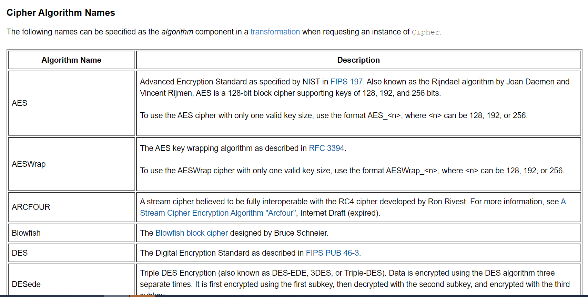
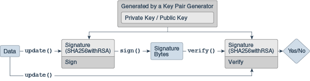

> https://docs.oracle.com/javase/8/docs/technotes/guides/security/crypto/CryptoSpec.html

Algorithm independence算法独立是通过如下cryptographic engines类来实现的：
> MessageDigest, Signature, KeyFactory, KeyPairGenerator, and Cipher classes.


Implementation independence实现独立是通过a "provider"-based architecture. The term Cryptographic Service Provider (CSP) 来实现的：
> provider

```
    md = MessageDigest.getInstance("SHA-256");
    md = MessageDigest.getInstance("SHA-256", "ProviderC");

```
### The algorithm name is not case-sensitive

### Engine classes
|engine classes|作用|
|---|---|
|SecureRandom|used to generate random or pseudo-random numbers.|
|MessageDigest|used to calculate the message digest (hash) of specified data.|
|Signature|initialized with keys, these are used to sign data and verify digital signatures.|
|Cipher|initialized with keys, these are used for encrypting/decrypting data. There are various types of algorithms: symmetric bulk encryption (e.g. AES), asymmetric encryption (e.g. RSA), and password-based encryption (e.g. PBE).|
|Message Authentication Codes (MAC)|like MessageDigests, these also generate hash values, but are first initialized with keys to protect the integrity of messages.|
|KeyFactory|used to convert existing opaque cryptographic keys of type Key into key specifications (transparent representations of the underlying key material), and vice versa.|
|SecretKeyFactory|used to convert existing opaque cryptographic keys of type SecretKey into key specifications (transparent representations of the underlying key material), and vice versa. SecretKeyFactorys are specialized KeyFactorys that create secret (symmetric) keys only.|
|KeyPairGenerator|used to generate a new pair of public and private keys suitable for use with a specified algorithm.|
|KeyGenerator|used to generate new secret keys for use with a specified algorithm.|
|KeyAgreement|used by two or more parties to agree upon and establish a specific key to use for a particular cryptographic operation.|
|AlgorithmParameters|used to store the parameters for a particular algorithm, including parameter encoding and decoding.|
|AlgorithmParameterGenerator|used to generate a set of AlgorithmParameters suitable for a specified algorithm.|
|KeyStore|used to create and manage a keystore. A keystore is a database of keys. Private keys in a keystore have a certificate chain associated with them, which authenticates the corresponding public key. A keystore also contains certificates from trusted entities.|
|CertificateFactory|used to create public key certificates and Certificate Revocation Lists (CRLs).|
|CertPathBuilder|used to build certificate chains (also known as certification paths).|
|CertPathValidator|used to validate certificate chains.|
|CertStore|used to retrieve Certificates and CRLs from a repository.|
|||


```
static EngineClassName getInstance(String algorithm)
    throws NoSuchAlgorithmException

static EngineClassName getInstance(String algorithm, String provider)
    throws NoSuchAlgorithmException, NoSuchProviderException

static EngineClassName getInstance(String algorithm, Provider provider)
    throws NoSuchAlgorithmException
    
    
where EngineClassName is the desired engine type (MessageDigest/Cipher/etc). For example:
    MessageDigest md = MessageDigest.getInstance("SHA-256");
    KeyAgreement ka = KeyAgreement.getInstance("DH", "SunJCE");    
```

### StandardNames
> https://docs.oracle.com/javase/8/docs/technotes/guides/security/StandardNames.html

### Cipher Algorithm Names



|Algorithm Name|Description|
|---|---|
|AES|	Advanced Encryption Standard as specified by NIST in FIPS 197. Also known as the Rijndael algorithm by Joan Daemen and Vincent Rijmen, AES is a 128-bit block cipher supporting keys of 128, 192, and 256 bits.To use the AES cipher with only one valid key size, use the format AES_<n>, where <n> can be 128, 192, or 256.|
|AESWrap|The AES key wrapping algorithm as described in RFC 3394.To use the AESWrap cipher with only one valid key size, use the format AESWrap_<n>, where <n> can be 128, 192, or 256.|
|ARCFOUR|	A stream cipher believed to be fully interoperable with the RC4 cipher developed by Ron Rivest. For more information, see A Stream Cipher Encryption Algorithm "Arcfour", Internet Draft (expired).|
|Blowfish|	The Blowfish block cipher designed by Bruce Schneier.|
|DES|	The Digital Encryption Standard as described in FIPS PUB 46-3.|
|DESede|	Triple DES Encryption (also known as DES-EDE, 3DES, or Triple-DES). Data is encrypted using the DES algorithm three separate times. It is first encrypted using the first subkey, then decrypted with the second subkey, and encrypted with the third subkey.|
|DESedeWrap|	The DESede key wrapping algorithm as described in RFC 3217.|
|ECIES|	Elliptic Curve Integrated Encryption Scheme|
|PBEWith\<digest>And\<encryption> PBEWith\<prf>And\<encryption>|	The password-based encryption algorithm found in (PKCS5), using the specified message digest (<digest>) or pseudo-random function (<prf>) and encryption algorithm (<encryption>). Examples: PBEWithMD5AndDES: The password-based encryption algorithm as defined in RSA Laboratories, "PKCS #5: Password-Based Encryption Standard, version 1.5, Nov 1993. Note that this algorithm implies CBC as the cipher mode and PKCS5Padding as the padding scheme and cannot be used with any other cipher modes or padding schemes. PBEWithHmacSHA256AndAES_128: The password-based encryption algorithm as defined in PKCS #5: Password-Based Cryptography Specification, Version 2.1.|
|RC2|	Variable-key-size encryption algorithms developed by Ron Rivest for RSA Data Security, Inc.
|RC4|	Variable-key-size encryption algorithms developed by Ron Rivest for RSA Data Security, Inc. (See note prior for ARCFOUR.)
|RC5|	Variable-key-size encryption algorithms developed by Ron Rivest for RSA Data Security, Inc.
|RSA|	The RSA encryption algorithm as defined in PKCS #1 v2.2

### Cipher Algorithm Modes


```
CBC	Cipher Block Chaining Mode, as defined in FIPS PUB 81.
CCM	Counter/CBC Mode, as defined in NIST Special Publication SP 800-38C: Recommendation for Block Cipher Modes of Operation: the CCM Mode for Authentication and Confidentiality.
CFB, CFBx	Cipher Feedback Mode, as defined in FIPS PUB 81.

Using modes such as CFB and OFB, block ciphers can encrypt data in units smaller than the cipher's actual block size. When requesting such a mode, you may optionally specify the number of bits to be processed at a time by appending this number to the mode name as shown in the "DES/CFB8/NoPadding" and "DES/OFB32/PKCS5Padding" transformations. If no such number is specified, a provider-specific default is used. (For example, the SunJCE provider uses a default of 64 bits for DES.) Thus, block ciphers can be turned into byte-oriented stream ciphers by using an 8-bit mode such as CFB8 or OFB8.
CTR	A simplification of OFB, Counter mode updates the input block as a counter.
CTS	Cipher Text Stealing, as described in Bruce Schneier's book Applied Cryptography-Second Edition, John Wiley and Sons, 1996.
ECB	Electronic Codebook Mode, as defined in FIPS PUB 81 (generally this mode should not be used for multiple blocks of data).
GCM	Galois/Counter Mode, as defined in NIST Special Publication SP 800-38D Recommendation for Block Cipher Modes of Operation: Galois/Counter Mode (GCM) and GMAC.
OFB, OFBx	Output Feedback Mode, as defined in FIPS PUB 81.

Using modes such as CFB and OFB, block ciphers can encrypt data in units smaller than the cipher's actual block size. When requesting such a mode, you may optionally specify the number of bits to be processed at a time by appending this number to the mode name as shown in the "DES/CFB8/NoPadding" and "DES/OFB32/PKCS5Padding" transformations. If no such number is specified, a provider-specific default is used. (For example, the SunJCE provider uses a default of 64 bits for DES.) Thus, block ciphers can be turned into byte-oriented stream ciphers by using an 8-bit mode such as CFB8 or OFB8.
PCBC	Propagating Cipher Block Chaining, as defined by Kerberos V4.
```
###  Cipher Algorithm Padding


```
NoPadding	No padding.
ISO10126Padding	This padding for block ciphers is described in 5.2 Block Encryption Algorithms in the W3C's "XML Encryption Syntax and Processing" document.
OAEPPadding, OAEPWith<digest>And<mgf>Padding	Optimal Asymmetric Encryption Padding scheme defined in PKCS #1, where <digest> should be replaced by the message digest and <mgf> by the mask generation function. Examples: OAEPWithMD5AndMGF1Padding and OAEPWithSHA-512AndMGF1Padding.

If OAEPPadding is used, Cipher objects are initialized with a javax.crypto.spec.OAEPParameterSpec object to supply values needed for OAEPPadding.
PKCS1Padding	The padding scheme described in PKCS #1 v2.2, used with the RSA algorithm.
PKCS5Padding	The padding scheme described in PKCS #5: Password-Based Cryptography Specification, version 2.1.
SSL3Padding	The padding scheme defined in the SSL Protocol Version 3.0, November 18, 1996, section 5.2.3.2 (CBC block cipher):
    block-ciphered struct {
        opaque content[SSLCompressed.length];
        opaque MAC[CipherSpec.hash_size];
        uint8 padding[
            GenericBlockCipher.padding_length];
        uint8 padding_length;
    } GenericBlockCipher;
The size of an instance of a GenericBlockCipher must be a multiple of the block cipher's block length.

The padding length, which is always present, contributes to the padding, which implies that if:
    sizeof(content) + sizeof(MAC) % block_length = 0, 
padding has to be (block_length - 1) bytes long, because of the existence of padding_length.

This makes the padding scheme similar (but not quite) to PKCS5Padding, where the padding length is encoded in the padding (and ranges from 1 to block_length). With the SSL scheme, the sizeof(padding) is encoded in the always present padding_length and therefore ranges from 0 to block_length-1.
```

### KeyFactory Algorithms


### KeyGenerator Algorithms


### KeyPairGenerator Algorithms


### MessageDigest Algorithms


### SecretKeyFactory Algorithms


### Signature Algorithms


### NOTE: General purpose applications SHOULD NOT request cryptographic services from specific providers. 


### List of providers and their preference orders (see above):
> C:\Program Files\Java\jre1.8.0_144\lib\security\java.security

```
security.provider.1=sun.security.provider.Sun
security.provider.2=sun.security.rsa.SunRsaSign
security.provider.3=sun.security.ec.SunEC
security.provider.4=com.sun.net.ssl.internal.ssl.Provider
security.provider.5=com.sun.crypto.provider.SunJCE
security.provider.6=sun.security.jgss.SunProvider
security.provider.7=com.sun.security.sasl.Provider
security.provider.8=org.jcp.xml.dsig.internal.dom.XMLDSigRI
security.provider.9=sun.security.smartcardio.SunPCSC
security.provider.10=sun.security.mscapi.SunMSCAPI
```


### Provider 算法提供者，算法实现

### Security 
> Security.getProviders() 获取所有Provider


### SecureRandom 随机数


#### 创建实例

```
方法一： new SecureRandom()
方法二： getInstance()

```

#### Seeding or Re-Seeding the SecureRandom Object

```
synchronized public void setSeed(byte[] seed)
public void setSeed(long seed)

```

#### Using a SecureRandom Object

```
synchronized public void nextBytes(byte[] bytes)

byte[] generateSeed(int numBytes)
```


### MessageDigest 输入任意大小数据，输出固定长度的数据


>  A cryptographically secure message digest takes arbitrary-sized input (a byte array), and generates a fixed-size output, called a digest or hash.


> They are sometimes called "checksums" or the "digital fingerprints" of the data.

> the SHA-256 algorithm produces a 32-byte digest, and SHA-512's is 64 bytes.
```
A digest has two properties:

It should be computationally infeasible to find two messages that hash to the same value.
The digest should not reveal anything about the input that was used to generate it.

```

#### Creating a MessageDigest Object

```
getInstance()
```

#### Updating a Message Digest Object

```
void update(byte input)
void update(byte[] input)
void update(byte[] input, int offset, int len)
```

#### Computing the Digest

```
byte[] digest()
byte[] digest(byte[] input)
int digest(byte[] buf, int offset, int len)
```

### Signature 输入任意大小数据和秘钥，输出固定长度的数据



> A cryptographically secure signature algorithm takes arbitrary-sized input and a private key and generates a relatively short (often fixed-size) string of bytes, called the signature.

> Even though a signature seems similar to a message digest, they have very different purposes in the type of protection they provide. 


```
Only the owner of a private/public key pair is able to create a signature. It should be computationally infeasible for anyone having a public key to recover the private key.
Given the public key corresponding to the private key used to generate the signature, it should be possible to verify the authenticity and integrity of the input.
The signature and the public key do not reveal anything about the private key.
```

#### Creating a Signature Object

```
getInstance()
```

#### Initializing a Signature Object
```
final void initSign(PrivateKey privateKey)

final void initVerify(PublicKey publicKey)

final void initVerify(Certificate certificate)
```

#### Signing
```
final void update(byte b)
final void update(byte[] data)
final void update(byte[] data, int off, int len)

final byte[] sign()
final int sign(byte[] outbuf, int offset, int len)
```

#### Verifying
```
final void update(byte b)
final void update(byte[] data)
final void update(byte[] data, int off, int len)

final boolean verify(byte[] signature)

final boolean verify(byte[] signature, int offset, int length)
```

### Cipher 加密和解密，加密：明文 + key -> 密文, 解密：密文 + key -> 明文


> The Cipher class provides the functionality of a cryptographic cipher used for encryption and decryption. Encryption is the process of taking data (called cleartext) and a key, and producing data (ciphertext) meaningless to a third-party who does not know the key. Decryption is the inverse process: that of taking ciphertext and a key and producing cleartext.


#### Symmetric vs. Asymmetric Cryptography 对称加密和非对称加密

> In symmetric cryptography, the same secret key to both encrypt and decrypt the data

> asymmetric cryptography uses a public/private key pair to encrypt data. Data encrypted with one key is decrypted with the other. 

> 非对称加密通常比较慢 Asymmetric algorithms (such as RSA) are generally much slower than symmetric ones. 


#### 1.Creating a Cipher Object

> It is recommended to use a transformation that fully specifies the algorithm, mode, and padding. 

```
getInstance()

A transformation is of the form:

"algorithm/mode/padding" or
"algorithm"

For example, the following are valid transformations:

    "AES/CBC/PKCS5Padding"

    "AES"
```

#### 2.Initializing a Cipher Object


```
 public void init(int opmode, Key key);

    public void init(int opmode, Certificate certificate);

    public void init(int opmode, Key key, SecureRandom random);

    public void init(int opmode, Certificate certificate,
                     SecureRandom random);

    public void init(int opmode, Key key,
                     AlgorithmParameterSpec params);

    public void init(int opmode, Key key,
                     AlgorithmParameterSpec params, SecureRandom random);

    public void init(int opmode, Key key,
                     AlgorithmParameters params);

    public void init(int opmode, Key key,
                     AlgorithmParameters params, SecureRandom random);
```

#### 3.Encrypting and Decrypting Data

```
To encrypt or decrypt data in a single step, call one of the doFinal methods:

    public byte[] doFinal(byte[] input);

    public byte[] doFinal(byte[] input, int inputOffset, int inputLen);

    public int doFinal(byte[] input, int inputOffset,
                       int inputLen, byte[] output);

    public int doFinal(byte[] input, int inputOffset,
                       int inputLen, byte[] output, int outputOffset)
To encrypt or decrypt data in multiple steps, call one of the update methods:

    public byte[] update(byte[] input);

    public byte[] update(byte[] input, int inputOffset, int inputLen);

    public int update(byte[] input, int inputOffset, int inputLen,
                      byte[] output);

    public int update(byte[] input, int inputOffset, int inputLen,
                      byte[] output, int outputOffset)
A multiple-part operation must be terminated by one of the above doFinal methods (if there is still some input data left for the last step), or by one of the following doFinal methods (if there is no input data left for the last step):

    public byte[] doFinal();

    public int doFinal(byte[] output, int outputOffset);
```


> Key factories are used to convert Keys (opaque cryptographic keys of type java.security.Key) into key specifications (transparent representations of the underlying key material in a suitable format), and vice versa.

### SecretKeyFactory 


#### Creating a SecretKeyFactory Object
```
 getInstance()
```

#### Converting Between a Key Specification and a Secret Key Object
```
SecretKey generateSecret(KeySpec keySpec)
```

#### Converting Between a Secret Key Object and a Key Specification
```
KeySpec getKeySpec(Key key, Class keySpec)
```

### KeyPairGenerator 


#### Creating a KeyPairGenerator

```
 getInstance()
```

#### Initializing a KeyPairGenerator

```
void initialize(int keysize, SecureRandom random)
void initialize(int keysize)

void initialize(AlgorithmParameterSpec params,
                SecureRandom random)
void initialize(AlgorithmParameterSpec params)
```

#### Generating a Key Pair
```
KeyPair generateKeyPair()
```

### KeyGenerator 


```
```

#### Creating a KeyGenerator

```
getInstance()
```

#### Initializing a KeyGenerator Object
```
    public void init(SecureRandom random);
    public void init(int keysize);
    public void init(int keysize, SecureRandom random);
    
    public void init(AlgorithmParameterSpec params);
    public void init(AlgorithmParameterSpec params, SecureRandom random);
```

#### Creating a Key

```
public SecretKey generateKey();
```


### CertificateFactory 

#### Creating a CertificateFactory Object
```
 getInstance()
```

#### Generating Certificate Objects
```
final Certificate generateCertificate(InputStream inStream)

final Collection generateCertificates(InputStream inStream)
```

#### Generating CRL Objects

```
final CRL generateCRL(InputStream inStream)

final Collection generateCRLs(InputStream inStream)
```

#### Generating CertPath Objects

```
final CertPath generateCertPath(InputStream inStream)

final CertPath generateCertPath(InputStream inStream,
                                String encoding)
                                
final CertPath generateCertPath(List certificates)

final Iterator getCertPathEncodings()
```

### X509EncodedKeySpec 用来生成public key, PKCS8EncodedKeySpec 用来生成private key
```

X509EncodedKeySpec keySpec = new X509EncodedKeySpec(Base64.decodeBase64(pbk));

KeyFactory keyFactory = KeyFactory.getInstance("RSA");

PublicKey publicKey = keyFactory.generatePublic(keySpec);


PKCS8EncodedKeySpec keySpec = new PKCS8EncodedKeySpec(Base64.decodeBase64(pvk));

KeyFactory keyFactory = KeyFactory.getInstance("RSA");

PrivateKey privateKey = keyFactory.generatePrivate(keySpec);
```

```
```

```
```

```
```

```
```

```
```

```
```

```
```


