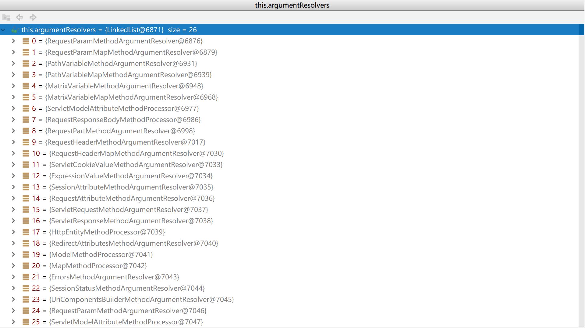
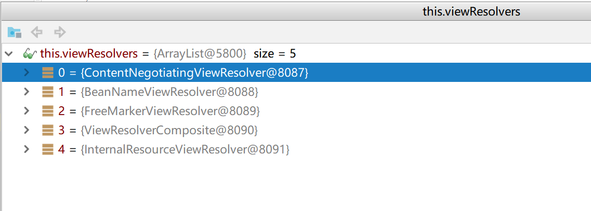

## Spring web MVC


### DispatcherServlet执行流程

> 1.根据请求对象request从handlerMappings中找到能处理这个请求的Handler，并将拦截器和Handler一并封装成HandlerExecutionChain。

> 2.根据前面获取到的Handler从handlerAdapters中找到匹配的HandlerAdapter并返回。

> 3.执行关联在HandlerExecutionChain上的所有拦截器的preHandle方法。

> 4.执行HandlerAdapter的handle方法(即被@RequestMapping修饰的我们自定义的方法)。

> 5.执行关联在HandlerExecutionChain上的所有拦截器的postHandle方法。

> 6.根据viewName获取视图，并渲染视图，最后执行所有拦截器的afterCompletion方法。


#### handle方法执行逻辑(实际执行的是被@RequestMapping修饰的方法)

> 1.通过遍历argumentResolvers匹配到目标方法所有入参对应的HandlerMethodArgumentResolver参数解析器，并得到相应的参数值。

> 2.通过反射调用目标方法(实际执行的是被@RequestMapping修饰的方法)并拿到返回值。

> 3.通过遍历returnValueHandlers找到能处理当前返回结果类型的HandlerMethodReturnValueHandler，并处理返回结果，例如：ViewNameMethodReturnValueHandler会将viewName设置到ModelAndViewContainer。

> 4.返回null或者通过ModelAndViewContainer生成ModelAndView对象并返回。

### processDispatchResult方法执行逻辑

> 1.遍历viewResolvers根据viewName匹配到相应的ViewResolver，执行resolveViewName方法获取到View对象。

> 2.调用View对象render方法渲染视图。

> 3.执行关联在HandlerExecutionChain上的所有拦截器的afterCompletion方法。


### method parameter binds
|注解|说明|
|---|---|
|@CookieValue|从cookie里面获取参数值|
|@MatrixVariable|用来绑定键值对的方法参数, 如:Map|
|@ModelAttribute|Annotation that binds a method parameter or method return value to a named model attribute|
|@PathVariable|从URL模板变量里面获取|
|@RequestAttribute|Annotation to bind a method parameter to a request attribute.|
|@RequestBody|用HttpMessageConverter从请求体中解析而来|
|@RequestHeader|从请求头获取|
|@RequestParam|从query parameters, form data, and parts in multipart requests.获取|
|@RequestPart|用于文件上传，参数类型是MultipartFile|
|@SessionAttribute|从session中获取参数值|
|@Value|从环境配置中获取|

### 方法的参数类型可以是: RedirectAttributes.class

### 方法的参数类型还可以是这些
> org.springframework.web.servlet.mvc.method.annotation.ServletRequestMethodArgumentResolver

``` 
public boolean supportsParameter(MethodParameter parameter) {
		Class<?> paramType = parameter.getParameterType();
		return (WebRequest.class.isAssignableFrom(paramType) ||
				ServletRequest.class.isAssignableFrom(paramType) ||
				MultipartRequest.class.isAssignableFrom(paramType) ||
				HttpSession.class.isAssignableFrom(paramType) ||
				(pushBuilder != null && pushBuilder.isAssignableFrom(paramType)) ||
				Principal.class.isAssignableFrom(paramType) ||
				InputStream.class.isAssignableFrom(paramType) ||
				Reader.class.isAssignableFrom(paramType) ||
				HttpMethod.class == paramType ||
				Locale.class == paramType ||
				TimeZone.class == paramType ||
				ZoneId.class == paramType);
	}
```

### HandlerMethodArgumentResolver方法参数解析器


### DispatcherServlet

> 1.根据请求对象request从handlerMappings中找到能处理这个请求的Handler，并将拦截器和Handler一并封装成HandlerExecutionChain。

> 2.根据前面获取到的Handler从handlerAdapters中找到匹配的HandlerAdapter并返回。

> 3.执行关联在HandlerExecutionChain上的所有拦截器的preHandle方法。

> 4.执行HandlerAdapter的handle方法(即被@RequestMapping修饰的我们自定义的方法)。

> 5.执行关联在HandlerExecutionChain上的所有拦截器的postHandle方法。

> 6.根据viewName获取视图，并渲染视图，最后执行所有拦截器的afterCompletion方法。


#### handle方法执行逻辑(实际执行的是被@RequestMapping修饰的方法)

> 1.通过遍历argumentResolvers匹配到目标方法所有入参对应的HandlerMethodArgumentResolver参数解析器，并得到相应的参数值。

> 2.通过反射调用目标方法(实际执行的是被@RequestMapping修饰的方法)并拿到返回值。

> 3.通过遍历returnValueHandlers找到能处理当前返回结果类型的HandlerMethodReturnValueHandler，并处理返回结果，例如：ViewNameMethodReturnValueHandler会将viewName设置到ModelAndViewContainer。

> 4.返回null或者通过ModelAndViewContainer生成ModelAndView对象并返回。

### processDispatchResult方法执行逻辑

> 1.遍历viewResolvers根据viewName匹配到相应的ViewResolver，执行resolveViewName方法获取到View对象。

> 2.调用View对象render方法渲染视图。

> 3.执行关联在HandlerExecutionChain上的所有拦截器的afterCompletion方法。


```java

public class DispatcherServlet extends FrameworkServlet {
    protected void doDispatch(HttpServletRequest request, HttpServletResponse response) throws Exception {
		HttpServletRequest processedRequest = request;
		HandlerExecutionChain mappedHandler = null;
		boolean multipartRequestParsed = false;

		WebAsyncManager asyncManager = WebAsyncUtils.getAsyncManager(request);

		try {
			ModelAndView mv = null;
			Exception dispatchException = null;

			try {
				processedRequest = checkMultipart(request);
				multipartRequestParsed = (processedRequest != request);

				// Determine handler for the current request.
				// 根据请求对象request从handlerMappings中找到能处理这个请求的Handler，并将拦截器和Handler一并封装成HandlerExecutionChain。
				mappedHandler = getHandler(processedRequest);
				if (mappedHandler == null) {
					noHandlerFound(processedRequest, response);
					return;
				}

				// Determine handler adapter for the current request.
				// 根据前面获取到的Handler从handlerAdapters中找到匹配的HandlerAdapter并返回。
				HandlerAdapter ha = getHandlerAdapter(mappedHandler.getHandler());

				// Process last-modified header, if supported by the handler.
				String method = request.getMethod();
				boolean isGet = "GET".equals(method);
				if (isGet || "HEAD".equals(method)) {
					long lastModified = ha.getLastModified(request, mappedHandler.getHandler());
					if (new ServletWebRequest(request, response).checkNotModified(lastModified) && isGet) {
						return;
					}
				}

                // 执行关联在HandlerExecutionChain上的所有拦截器的preHandle方法。
				if (!mappedHandler.applyPreHandle(processedRequest, response)) {
					return;
				}

				// Actually invoke the handler.
				// 执行HandlerAdapter的handle方法(即被@RequestMapping修饰的我们自定义的方法)。
				mv = ha.handle(processedRequest, response, mappedHandler.getHandler());

				if (asyncManager.isConcurrentHandlingStarted()) {
					return;
				}

				applyDefaultViewName(processedRequest, mv);
				// 执行关联在HandlerExecutionChain上的所有拦截器的postHandle方法。
				mappedHandler.applyPostHandle(processedRequest, response, mv);
			}
			catch (Exception ex) {
				dispatchException = ex;
			}
			catch (Throwable err) {
				// As of 4.3, we're processing Errors thrown from handler methods as well,
				// making them available for @ExceptionHandler methods and other scenarios.
				dispatchException = new NestedServletException("Handler dispatch failed", err);
			}
			// 根据viewName获取视图，并渲染视图，最后执行所有拦截器的afterCompletion方法。
			processDispatchResult(processedRequest, response, mappedHandler, mv, dispatchException);
		}
		catch (Exception ex) {
			triggerAfterCompletion(processedRequest, response, mappedHandler, ex);
		}
		catch (Throwable err) {
			triggerAfterCompletion(processedRequest, response, mappedHandler,
					new NestedServletException("Handler processing failed", err));
		}
		finally {
			if (asyncManager.isConcurrentHandlingStarted()) {
				// Instead of postHandle and afterCompletion
				if (mappedHandler != null) {
					mappedHandler.applyAfterConcurrentHandlingStarted(processedRequest, response);
				}
			}
			else {
				// Clean up any resources used by a multipart request.
				if (multipartRequestParsed) {
					cleanupMultipart(processedRequest);
				}
			}
		}
	}
	
	
	
	protected HandlerExecutionChain getHandler(HttpServletRequest request) throws Exception {
    		if (this.handlerMappings != null) {
    			for (HandlerMapping mapping : this.handlerMappings) {
    				HandlerExecutionChain handler = mapping.getHandler(request);
    				if (handler != null) {
    					return handler;
    				}
    			}
    		}
    		return null;
    	}

    // 获取并渲染视图
    protected void render(ModelAndView mv, HttpServletRequest request, HttpServletResponse response) throws Exception {
		// Determine locale for request and apply it to the response.
		Locale locale =
				(this.localeResolver != null ? this.localeResolver.resolveLocale(request) : request.getLocale());
		response.setLocale(locale);

		View view;
		String viewName = mv.getViewName();
		if (viewName != null) {
			// We need to resolve the view name.
			// 获取视图
			view = resolveViewName(viewName, mv.getModelInternal(), locale, request);
			if (view == null) {
				throw new ServletException("Could not resolve view with name '" + mv.getViewName() +
						"' in servlet with name '" + getServletName() + "'");
			}
		}
		else {
			// No need to lookup: the ModelAndView object contains the actual View object.
			view = mv.getView();
			if (view == null) {
				throw new ServletException("ModelAndView [" + mv + "] neither contains a view name nor a " +
						"View object in servlet with name '" + getServletName() + "'");
			}
		}

		// Delegate to the View object for rendering.
		if (logger.isTraceEnabled()) {
			logger.trace("Rendering view [" + view + "] ");
		}
		try {
			if (mv.getStatus() != null) {
				response.setStatus(mv.getStatus().value());
			}
			// 渲染视图
			view.render(mv.getModelInternal(), request, response);
		}
		catch (Exception ex) {
			if (logger.isDebugEnabled()) {
				logger.debug("Error rendering view [" + view + "]", ex);
			}
			throw ex;
		}
	}
    	
    protected View resolveViewName(String viewName, @Nullable Map<String, Object> model,
			Locale locale, HttpServletRequest request) throws Exception {

		if (this.viewResolvers != null) {
		    // 从viewResolvers获取匹配的视图解析器
			for (ViewResolver viewResolver : this.viewResolvers) {
				View view = viewResolver.resolveViewName(viewName, locale);
				if (view != null) {
					return view;
				}
			}
		}
		return null;
	}    
}
```


### 国际化：LocaleResolver

```java
public interface LocaleResolver {

	/**
	 * Resolve the current locale via the given request.
	 * Can return a default locale as fallback in any case.
	 * @param request the request to resolve the locale for
	 * @return the current locale (never {@code null})
	 */
	Locale resolveLocale(HttpServletRequest request);

	/**
	 * Set the current locale to the given one.
	 * @param request the request to be used for locale modification
	 * @param response the response to be used for locale modification
	 * @param locale the new locale, or {@code null} to clear the locale
	 * @throws UnsupportedOperationException if the LocaleResolver
	 * implementation does not support dynamic changing of the locale
	 */
	void setLocale(HttpServletRequest request, @Nullable HttpServletResponse response, @Nullable Locale locale);
}
```


### 视图解析器：ViewResolver

```java
public interface ViewResolver {
    /**
	 * Resolve the given view by name.
	 * <p>Note: To allow for ViewResolver chaining, a ViewResolver should
	 * return {@code null} if a view with the given name is not defined in it.
	 * However, this is not required: Some ViewResolvers will always attempt
	 * to build View objects with the given name, unable to return {@code null}
	 * (rather throwing an exception when View creation failed).
	 * @param viewName name of the view to resolve
	 * @param locale the Locale in which to resolve the view.
	 * ViewResolvers that support internationalization should respect this.
	 * @return the View object, or {@code null} if not found
	 * (optional, to allow for ViewResolver chaining)
	 * @throws Exception if the view cannot be resolved
	 * (typically in case of problems creating an actual View object)
	 */
	@Nullable
	View resolveViewName(String viewName, Locale locale) throws Exception;
}

```

### 视图：View

```java
public interface View {

	/**
	 * Render the view given the specified model.
	 * <p>The first step will be preparing the request: In the JSP case, this would mean
	 * setting model objects as request attributes. The second step will be the actual
	 * rendering of the view, for example including the JSP via a RequestDispatcher.
	 * @param model a Map with name Strings as keys and corresponding model
	 * objects as values (Map can also be {@code null} in case of empty model)
	 * @param request current HTTP request
	 * @param response he HTTP response we are building
	 * @throws Exception if rendering failed
	 */
	void render(@Nullable Map<String, ?> model, HttpServletRequest request, HttpServletResponse response)
			throws Exception;

}
```

### FreeMarker的View.render()处理视图
``` 

org.springframework.web.servlet.view.freemarker.FreeMarkerView.processTemplate

protected void processTemplate(Template template, SimpleHash model, HttpServletResponse response)
			throws IOException, TemplateException {

		template.process(model, response.getWriter());
	}
	
	
```


### 初始化RequestMappingHandlerMapping()
``` 
org.springframework.boot.autoconfigure.web.servlet.WebMvcAutoConfiguration.EnableWebMvcConfiguration


   
    
    @Bean
    @Primary
    @Override
    public RequestMappingHandlerMapping requestMappingHandlerMapping() {
        // Must be @Primary for MvcUriComponentsBuilder to work
        return super.requestMappingHandlerMapping();
    }

org.springframework.web.servlet.config.annotation.WebMvcConfigurationSupport.requestMappingHandlerMapping

@Bean
	public RequestMappingHandlerMapping requestMappingHandlerMapping() {
		RequestMappingHandlerMapping mapping = createRequestMappingHandlerMapping();
		mapping.setOrder(0);
		// 初始化拦截器
		mapping.setInterceptors(getInterceptors());
		mapping.setContentNegotiationManager(mvcContentNegotiationManager());
		mapping.setCorsConfigurations(getCorsConfigurations());

		PathMatchConfigurer configurer = getPathMatchConfigurer();

		Boolean useSuffixPatternMatch = configurer.isUseSuffixPatternMatch();
		if (useSuffixPatternMatch != null) {
			mapping.setUseSuffixPatternMatch(useSuffixPatternMatch);
		}
		Boolean useRegisteredSuffixPatternMatch = configurer.isUseRegisteredSuffixPatternMatch();
		if (useRegisteredSuffixPatternMatch != null) {
			mapping.setUseRegisteredSuffixPatternMatch(useRegisteredSuffixPatternMatch);
		}
		Boolean useTrailingSlashMatch = configurer.isUseTrailingSlashMatch();
		if (useTrailingSlashMatch != null) {
			mapping.setUseTrailingSlashMatch(useTrailingSlashMatch);
		}

		UrlPathHelper pathHelper = configurer.getUrlPathHelper();
		if (pathHelper != null) {
			mapping.setUrlPathHelper(pathHelper);
		}
		PathMatcher pathMatcher = configurer.getPathMatcher();
		if (pathMatcher != null) {
			mapping.setPathMatcher(pathMatcher);
		}
		Map<String, Predicate<Class<?>>> pathPrefixes = configurer.getPathPrefixes();
		if (pathPrefixes != null) {
			mapping.setPathPrefixes(pathPrefixes);
		}

		return mapping;
	}
			
```

### 从MyMvcConfig中初始化拦截器
``` 
	
org.springframework.web.servlet.config.annotation.WebMvcConfigurationSupport.getInterceptors


protected final Object[] getInterceptors() {
		if (this.interceptors == null) {
			InterceptorRegistry registry = new InterceptorRegistry();
			addInterceptors(registry);
			registry.addInterceptor(new ConversionServiceExposingInterceptor(mvcConversionService()));
			registry.addInterceptor(new ResourceUrlProviderExposingInterceptor(mvcResourceUrlProvider()));
			this.interceptors = registry.getInterceptors();
		}
		return this.interceptors.toArray();
	}
```


### 匹配@RequestMapping里面定义的各种参数
``` 

org.springframework.web.servlet.mvc.method.RequestMappingInfo.getMatchingCondition

public RequestMappingInfo getMatchingCondition(HttpServletRequest request) {
		RequestMethodsRequestCondition methods = this.methodsCondition.getMatchingCondition(request);
		if (methods == null) {
			return null;
		}
		ParamsRequestCondition params = this.paramsCondition.getMatchingCondition(request);
		if (params == null) {
			return null;
		}
		HeadersRequestCondition headers = this.headersCondition.getMatchingCondition(request);
		if (headers == null) {
			return null;
		}
		ConsumesRequestCondition consumes = this.consumesCondition.getMatchingCondition(request);
		if (consumes == null) {
			return null;
		}
		ProducesRequestCondition produces = this.producesCondition.getMatchingCondition(request);
		if (produces == null) {
			return null;
		}
		PatternsRequestCondition patterns = this.patternsCondition.getMatchingCondition(request);
		if (patterns == null) {
			return null;
		}
		RequestConditionHolder custom = this.customConditionHolder.getMatchingCondition(request);
		if (custom == null) {
			return null;
		}

		return new RequestMappingInfo(this.name, patterns,
				methods, params, headers, consumes, produces, custom.getCondition());
	}

```


### 将Handler(HandlerMethod)封装成HandlerExecutionChain，并关联上拦截器。
``` 

protected HandlerExecutionChain getHandlerExecutionChain(Object handler, HttpServletRequest request) {
		HandlerExecutionChain chain = (handler instanceof HandlerExecutionChain ?
				(HandlerExecutionChain) handler : new HandlerExecutionChain(handler));

		String lookupPath = this.urlPathHelper.getLookupPathForRequest(request);
		for (HandlerInterceptor interceptor : this.adaptedInterceptors) {
			if (interceptor instanceof MappedInterceptor) {
				MappedInterceptor mappedInterceptor = (MappedInterceptor) interceptor;
				if (mappedInterceptor.matches(lookupPath, this.pathMatcher)) {
					chain.addInterceptor(mappedInterceptor.getInterceptor());
				}
			}
			else {
				chain.addInterceptor(interceptor);
			}
		}
		return chain;
	}

```

### RequestMappingHandlerAdapter


### 被@RequestMapping修饰的方法的参数，找到各个参数对应的解析器：HandlerMethodArgumentResolver


```

org.springframework.web.method.support.HandlerMethodArgumentResolverComposite.getArgumentResolver

private HandlerMethodArgumentResolver getArgumentResolver(MethodParameter parameter) {
		HandlerMethodArgumentResolver result = this.argumentResolverCache.get(parameter);
		if (result == null) {
			for (HandlerMethodArgumentResolver methodArgumentResolver : this.argumentResolvers) {
				if (methodArgumentResolver.supportsParameter(parameter)) {
					result = methodArgumentResolver;
					this.argumentResolverCache.put(parameter, result);
					break;
				}
			}
		}
		return result;
	}
```

### 通过反射调用被@RequestMapping修饰的目标方法
``` 
org.springframework.web.method.support.InvocableHandlerMethod.doInvoke

protected Object doInvoke(Object... args) throws Exception {
		ReflectionUtils.makeAccessible(getBridgedMethod());
		try {
		    // 通过反射调用被@RequestMapping修饰的目标方法
			return getBridgedMethod().invoke(getBean(), args);
		}
		catch (IllegalArgumentException ex) {
			assertTargetBean(getBridgedMethod(), getBean(), args);
			String text = (ex.getMessage() != null ? ex.getMessage() : "Illegal argument");
			throw new IllegalStateException(formatInvokeError(text, args), ex);
		}
		catch (InvocationTargetException ex) {
			// Unwrap for HandlerExceptionResolvers ...
			Throwable targetException = ex.getTargetException();
			if (targetException instanceof RuntimeException) {
				throw (RuntimeException) targetException;
			}
			else if (targetException instanceof Error) {
				throw (Error) targetException;
			}
			else if (targetException instanceof Exception) {
				throw (Exception) targetException;
			}
			else {
				throw new IllegalStateException(formatInvokeError("Invocation failure", args), targetException);
			}
		}
	}
	
```


### 选择合适的HandlerMethodReturnValueHandler处理被@RequestMapping修饰的目标方法返回的结果
``` 
org.springframework.web.servlet.mvc.method.annotation.ServletInvocableHandlerMethod.invokeAndHandle

public void invokeAndHandle(ServletWebRequest webRequest, ModelAndViewContainer mavContainer,
			Object... providedArgs) throws Exception {

		Object returnValue = invokeForRequest(webRequest, mavContainer, providedArgs);
		setResponseStatus(webRequest);

		if (returnValue == null) {
			if (isRequestNotModified(webRequest) || getResponseStatus() != null || mavContainer.isRequestHandled()) {
				disableContentCachingIfNecessary(webRequest);
				mavContainer.setRequestHandled(true);
				return;
			}
		}
		else if (StringUtils.hasText(getResponseStatusReason())) {
			mavContainer.setRequestHandled(true);
			return;
		}

		mavContainer.setRequestHandled(false);
		Assert.state(this.returnValueHandlers != null, "No return value handlers");
		try {
			this.returnValueHandlers.handleReturnValue(
					returnValue, getReturnValueType(returnValue), mavContainer, webRequest);
		}
		catch (Exception ex) {
			if (logger.isTraceEnabled()) {
				logger.trace(formatErrorForReturnValue(returnValue), ex);
			}
			throw ex;
		}
	}
	


org.springframework.web.method.support.HandlerMethodReturnValueHandlerComposite.selectHandler


    public void handleReturnValue(@Nullable Object returnValue, MethodParameter returnType,
			ModelAndViewContainer mavContainer, NativeWebRequest webRequest) throws Exception {

		HandlerMethodReturnValueHandler handler = selectHandler(returnValue, returnType);
		if (handler == null) {
			throw new IllegalArgumentException("Unknown return value type: " + returnType.getParameterType().getName());
		}
		handler.handleReturnValue(returnValue, returnType, mavContainer, webRequest);
	}

	@Nullable
	private HandlerMethodReturnValueHandler selectHandler(@Nullable Object value, MethodParameter returnType) {
		boolean isAsyncValue = isAsyncReturnValue(value, returnType);
		for (HandlerMethodReturnValueHandler handler : this.returnValueHandlers) {
			if (isAsyncValue && !(handler instanceof AsyncHandlerMethodReturnValueHandler)) {
				continue;
			}
			if (handler.supportsReturnType(returnType)) {
				return handler;
			}
		}
		return null;
	}
```

### 返回值处理器：HandlerMethodReturnValueHandler
> 被@RequestMapping修饰的目标方法返回类型处理器

|处理类|supportsReturnType|
|---|---|
|ModelAndViewMethodReturnValueHandler|ModelAndView.class|
|ModelMethodProcessor|Model.class|
|ViewMethodReturnValueHandler|View.class|
|ResponseBodyEmitterReturnValueHandler|ResponseBodyEmitter.class|
|StreamingResponseBodyReturnValueHandler|StreamingResponseBody.class|
|HttpEntityMethodProcessor|HttpEntity.class|
|HttpHeadersReturnValueHandler|HttpHeaders.class|
|CallableMethodReturnValueHandler|Callable.class|
|DeferredResultMethodReturnValueHandler|DeferredResult或者ListenableFuture.class或者CompletionStage.class|
|AsyncTaskMethodReturnValueHandler|WebAsyncTask.class|
|ModelAttributeMethodProcessor|方法被@ModelAttribute修饰，returnType.hasMethodAnnotation(ModelAttribute.class)|
|RequestResponseBodyMethodProcessor|方法或者方法所在类被ResponseBody.class注解修饰|
|ViewNameMethodReturnValueHandler|返回值是void或者是字符串|
|MapMethodProcessor|Map.class|
|||


### ViewResolver视图解析器

> 最终通过AbstractTemplateView.renderMergedTemplateModel()来渲染视图。



```
org.springframework.web.servlet.DispatcherServlet.render

protected void render(ModelAndView mv, HttpServletRequest request, HttpServletResponse response) throws Exception {
		// Determine locale for request and apply it to the response.
		Locale locale =
				(this.localeResolver != null ? this.localeResolver.resolveLocale(request) : request.getLocale());
		response.setLocale(locale);

		View view;
		String viewName = mv.getViewName();
		if (viewName != null) {
			// We need to resolve the view name.
			view = resolveViewName(viewName, mv.getModelInternal(), locale, request);
			if (view == null) {
				throw new ServletException("Could not resolve view with name '" + mv.getViewName() +
						"' in servlet with name '" + getServletName() + "'");
			}
		}
		else {
			// No need to lookup: the ModelAndView object contains the actual View object.
			view = mv.getView();
			if (view == null) {
				throw new ServletException("ModelAndView [" + mv + "] neither contains a view name nor a " +
						"View object in servlet with name '" + getServletName() + "'");
			}
		}

		// Delegate to the View object for rendering.
		if (logger.isTraceEnabled()) {
			logger.trace("Rendering view [" + view + "] ");
		}
		try {
			if (mv.getStatus() != null) {
				response.setStatus(mv.getStatus().value());
			}
			view.render(mv.getModelInternal(), request, response);
		}
		catch (Exception ex) {
			if (logger.isDebugEnabled()) {
				logger.debug("Error rendering view [" + view + "]", ex);
			}
			throw ex;
		}
	}
	
	@Nullable
	protected View resolveViewName(String viewName, @Nullable Map<String, Object> model,
			Locale locale, HttpServletRequest request) throws Exception {

		if (this.viewResolvers != null) {
			for (ViewResolver viewResolver : this.viewResolvers) {
				View view = viewResolver.resolveViewName(viewName, locale);
				if (view != null) {
					return view;
				}
			}
		}
		return null;
	}

```


### AOP, HandlerInterceptor拦截器，ControllerAdvice比较

|比较项|AOP|HandlerInterceptor|ControllerAdvice|
|---|---|---|---|
|能否获取目标方法的入参对象|可以|不可以|beforeBodyRead不可以，afterBodyRead方法可以|
|能否获取目标方法的返回对象|可以|不可以，但是可以获取ModelAndView对象|可以|
|使用范围限制|没有|没有|只能处理被@RequestBody，@ResponseBody注解修饰或者出入参类型是HttpEntity，ResponseEntity的方法|


