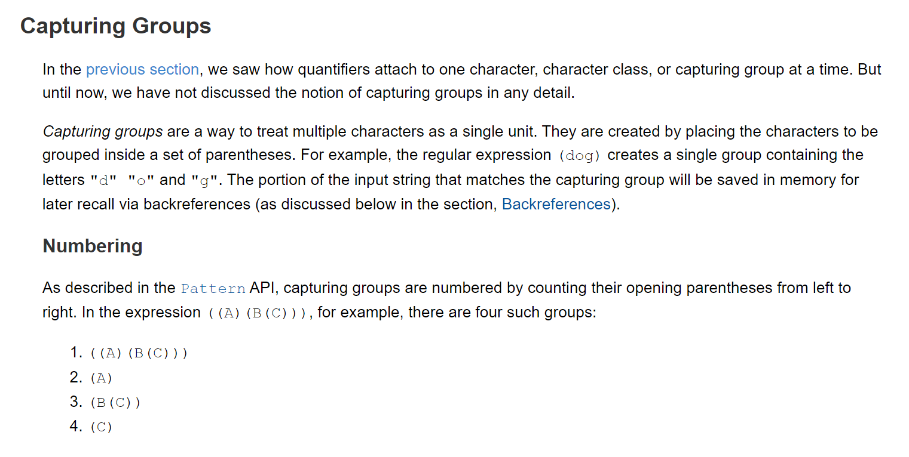

# 正则表达式
> 官方文档：https://docs.oracle.com/javase/tutorial/essential/regex/index.html

## Character Classes 字符类

## Predefined Character Classes  7个预定义的字符类

## Quantifiers 量词： 0, 1, n

## Capturing Groups 捕获组 用圆括号括起来()

## Boundary Matchers 边界：开头、结尾

